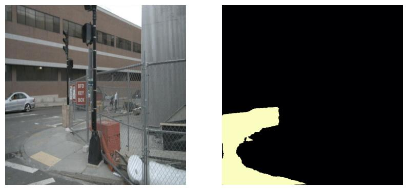

# Real-Time Drivable Space Segmentation for Level 4 Autonomous Systems
## 1. Project Overview 
This project implements a high-frequency perception pipeline designed for Level 4 Autonomous Driving. The core objective is to perform real-time semantic segmentation of urban road surfaces, enabling autonomous vehicles to identify traversable paths while distinguishing them from non-drivable obstacles like sidewalks, vegetation, and curbs.
**Key Features:**
* Task Type: Pixel-wise Semantic Segmentation.
* Target Hardware: Optimized for GPU-accelerated inference (NVIDIA T4).
* Robustness: Engineered to handle diverse urban lighting and sensor noise.
## 2. Model Architecture 
We utilized a custom-built U-Net architecture designed from scratch to ensure a lightweight footprint suitable for real-time applications.
* Encoder (Downsampling): Extracts high-level semantic features from $640 \times 640$ input images.
* Decoder (Upsampling): Restores spatial resolution to produce a precise binary mask.
* Skip Connections: Preserves fine-grained boundary details by passing features directly from the encoder to the decoder.
* Hybrid Loss Function: Combines Binary Cross Entropy (BCE) and Dice Loss to solve class imbalance and ensure sharp road boundaries.
## 3. Dataset & Training 
* Data Source: Custom urban navigation dataset derived from nuScenes/Roboflow.
* Preprocessing: Images resized to $640 \times 640$ and normalized.
* Augmentation: To increase model robustness, we applied: 
    * Horizontal Flips
    * Random Rotations (up to 35°)
    * Random Brightness & Contrast adjustments
* Hardware: Trained on NVIDIA T4 GPU (Cloud) to achieve high-frequency performance.
## 4. Performance Benchmarks 
Our model meets the "High-Frequency" requirement for real-time autonomous perception.
MetricResults: 
* Mean IoU (mIoU): 75.82%
* Inference Speed (GPU): 18.42 FPS
* Input Resolution: $640 \times 640$
## 5. Setup & Installation 
* Prerequisites:
    * Python 3.10 +
    * PyTorch (with CUDA support recommended)
    * Albumentations, OpenCV, Matplotlib, TQDM
* Installation:
    ```
    git clone [(https://github.com/Sreetanvi/Drivable_Space_Segmentation)]
    cd Drivable_space_project
    pip install torch torchvision albumentations matplotlib numpy
## 6. How to Run To verify the model and generate your own drivable space masks:
* Place your test images in data/test/.
* Ensure my_checkpoint.pth is in the root directory.
* Run the evaluation script:
  `python test.py`
The script will output the mIoU and FPS metrics and save visualized results in the /test_results/ folder.
## 7. Example Outputs 
Below are examples of the model identifying drivable surfaces in urban scenes:
**Input vs AI Prediction**

## 8. Model Weights
Due to file size restrictions, the trained model weights (my_checkpoint.pth) can be downloaded here: [(https://drive.google.com/file/d/1dg5uWe0ILluvFh8KZ6r_-onjoL8bVPG-/view?usp=drive_link)]. Please place this file in the root directory before running `test.py`.

